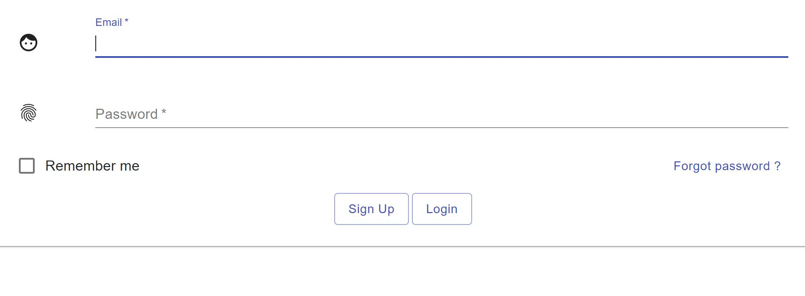
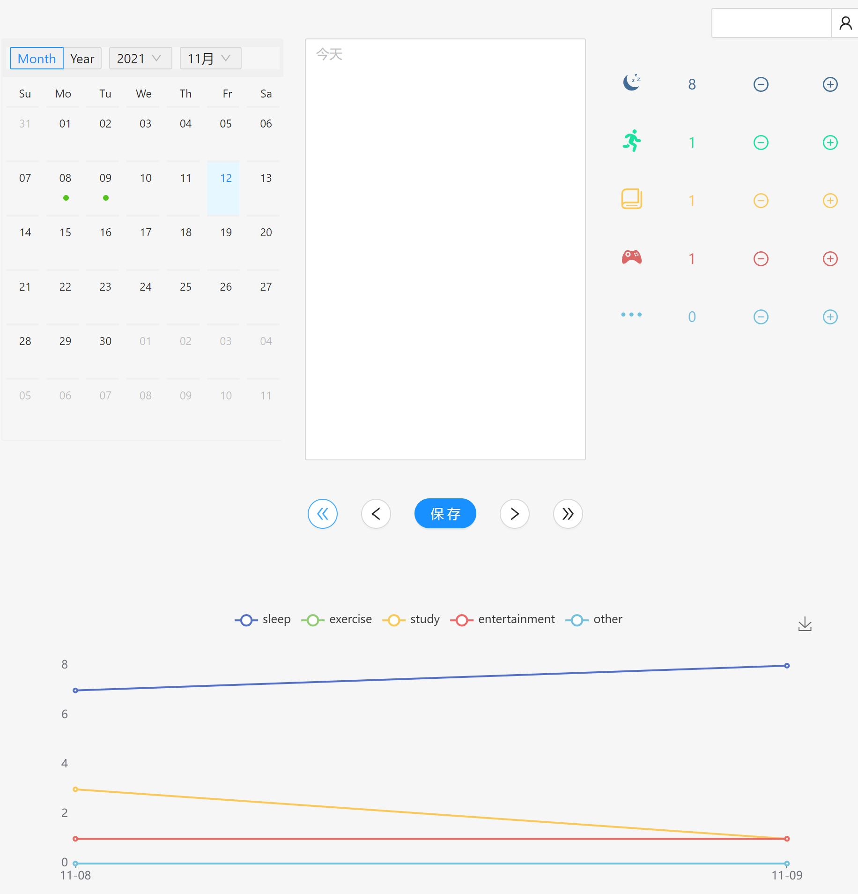
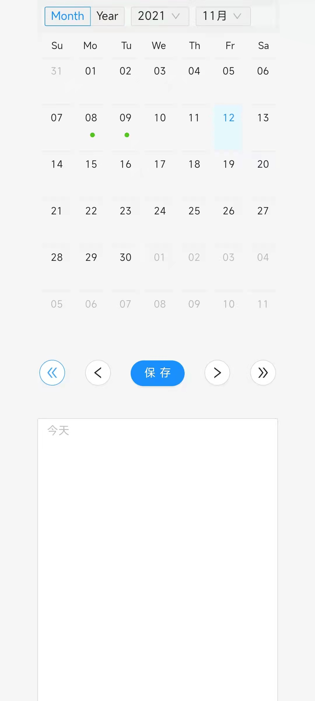
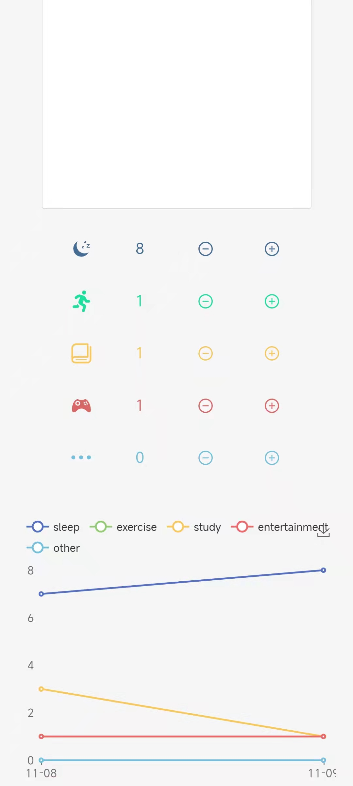

# Diary App

## 简易日记网站  
可以记录和查看日记，统计每日时间安排   
参考 https://github.com/Buuntu/fastapi-react 开发

# 实现
## 前端
框架： React  
UI： Ant Design  
图表： ECharts  

## 后端
框架: Fastapi  
数据库： sqlite3  

# 运行
## 本地
```bash
cd backend 
python3 -m venv venv
source venv/bin/activate
pip install -r requirements
bash run.bash
cd frontend
yarn
yarn start
```

## docker
```bash
docker-compose up -d
```

# 效果
## 登录界面


## 日记界面


## 竖屏显示


